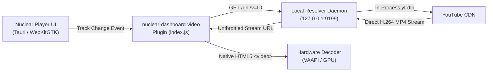

# Nuclear Dashboard Video Companion Plugin

[](LICENSE)
[](https://github.com/nukeop/nuclear)
[](https://github.com/HuggingBunny)

An ad-free, zero-control, auto-resizing YouTube music video companion for the **Nuclear Music Player** dashboard.

Plays the visual video stream corresponding to your currently playing song in sync with Nuclear's playback, with hardware-accelerated H.264 decoding, sub-second stream loading, and instant track transitions.

---

## Features

- **Clean Visual Presentation**: Zero playback controls, scrub bars, or YouTube overlays across the video canvas. Auto-scales dynamically to fit the dashboard workspace at full 16:9 aspect ratio.
- **Top-Right Fullscreen Toggle**: Subtle, frosted-blur toggle button in the top-right corner with auto-hiding cursor after 2.5s of mouse inactivity.
- **Sub-Second Stream Resolution**: Persistent in-process `yt-dlp` daemon on `127.0.0.1:9199` caches and serves video streams in under 0.8s on cold lookups.
- **Instant Track Transitions (0.01s)**: Delayed queue lookahead pre-resolves the next track 2.5s into playback without competing with active network bandwidth.
- **GPU-Accelerated Playback**: Strictly targets H.264 (`avc1` / `itag 136`) 720p streams to enable hardware VAAPI/NVDEC decode, keeping CPU utilization below 8%.
- **Zero Decoder Thrashing**: Respects WebKitGTK's media pipeline by only seeking on manual timeline scrubs (>6.0s), preventing frame drops and buffering stutters.
- **Sidebar & Route Isolated**: Mounts exclusively inside `main[data-testid="player-workspace-main"]` on the `/dashboard` route. Automatically suspends rendering when navigating to settings, search, or playlists.

---

## Architecture

Traditional YouTube iframe embeds fail in Nuclear/Tauri on Linux with **Error 153 (`Video player configuration error`)** because WebKitGTK uses a non-standard `tauri://localhost` security origin that YouTube's embed player strictly rejects.

This plugin bypasses iframe restrictions by playing native MP4 streams directly in an HTML5 `<video>` element, resolved via a lightweight local daemon.



---

## Installation

### Method 1: Automated Script (Linux)

Clone the repository and run the installer:

```bash
git clone https://github.com/HuggingBunny/nuclear-dashboard-video.git
cd nuclear-dashboard-video
./install.sh
```

The script will:
1. Copy the plugin files to `~/.local/share/com.nuclearplayer/plugins/nuclear-dashboard-video/1.0.0/`.
2. Register the plugin in `~/.local/share/com.nuclearplayer/plugins.json`.
3. Install and activate the systemd user service `nuclear-video.service` on `127.0.0.1:9199`.

Restart Nuclear Music Player to activate the companion.

---

### Method 2: Manual Installation

1. **Install the Companion Resolver Service**:
   ```bash
   mkdir -p ~/.local/bin ~/.config/systemd/user
   cp service/nuclear-video-service.py ~/.local/bin/nuclear-video-service.py
   chmod +x ~/.local/bin/nuclear-video-service.py
   cp service/nuclear-video.service ~/.config/systemd/user/nuclear-video.service
   systemctl --user daemon-reload
   systemctl --user enable --now nuclear-video.service
   ```

2. **Install the Plugin Package**:
   ```bash
   mkdir -p ~/.local/share/com.nuclearplayer/plugins/nuclear-dashboard-video/1.0.0
   cp package.json index.js ~/.local/share/com.nuclearplayer/plugins/nuclear-dashboard-video/1.0.0/
   ```

3. **Register the Plugin**:
   Add the following block to `~/.local/share/com.nuclearplayer/plugins.json`:
   ```json
   "nuclear-dashboard-video": {
     "version": "1.0.0",
     "enabled": true,
     "path": "~/.local/share/com.nuclearplayer/plugins/nuclear-dashboard-video/1.0.0"
   }
   ```

---

## Packaging for Release

To package the plugin archive for GitHub Releases:

```bash
npm run package
# Generates plugin.zip
```

Attach `plugin.zip` to your GitHub Release tag (e.g., `v1.0.0`).

---

## Submitting to Nuclear Plugin Registry

To have this plugin featured in the official Nuclear in-app Plugin Store:

1. Fork the official [NuclearPlayer/plugin-registry](https://github.com/NuclearPlayer/plugin-registry) repository.
2. Add the entry from [`registry-entry.json`](registry-entry.json) into `plugins.json`:
   ```json
   {
     "id": "nuclear-dashboard-video",
     "name": "Dashboard Video Companion",
     "description": "Zero-control auto-resizing YouTube video companion on the Nuclear Dashboard for the currently playing track",
     "author": "Chad Longanecker",
     "repo": "HuggingBunny/nuclear-dashboard-video",
     "category": "dashboard",
     "categories": ["dashboard", "integration"],
     "tags": ["youtube", "video", "dashboard", "companion", "music-video"],
     "version": "1.0.0",
     "downloadUrl": "https://github.com/HuggingBunny/nuclear-dashboard-video/releases/download/v1.0.0/plugin.zip",
     "addedAt": "2026-09-30T00:00:00Z"
   }
   ```
3. Open a Pull Request against `NuclearPlayer/plugin-registry:master`.

---

## Author

**Chad Longanecker**  
Security Automation & DevSecOps Engineer  
[GitHub Profile](https://github.com/HuggingBunny)

---

## License

This project is licensed under the MIT License — see the [LICENSE](LICENSE) file for details.
